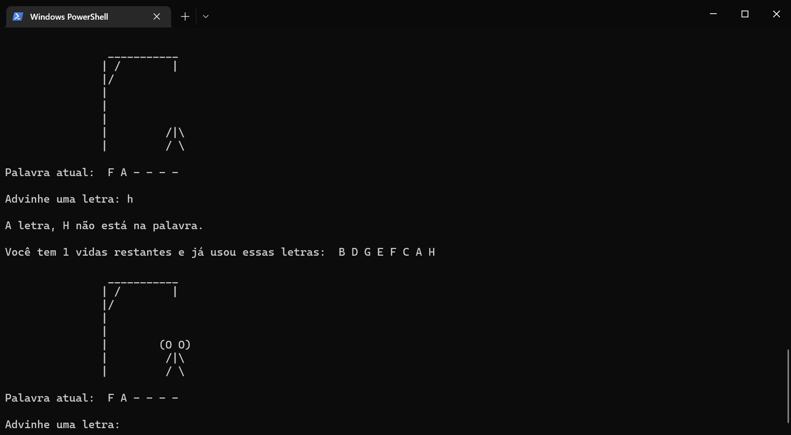

# hangman-python

# Descrição do projeto
Jogo da Forca, Hangman, desenvolvido em Python.

Divertido jogo para testar o conhecimento ou aprender novas palavras.

Tente advinhar o nome de uma das centenas de linguagens de programação, em uso atual ou histórico, listados no jogo.

Use somente letras de A a Z, ignore números, hifens, espaços em branco ou caracteres especiais.

Exemplo: Se achar que a resposta é "C#", digite "csharp", pode digitar maiúscula ou minúscula, o programa entende ambos.

Acaba quando acertar a palavra ou errar 7 vezes.

Se nunca tiver ouvido falar na linguagem, não acreditar que ela tem aquele nome ou ficar curioso para saber mais, no final tem um link para mais informações.

 

# Captura de tela

# Rodando o projeto
* git clone + a URL fornecida no botão "Code" acima.
 ou 
* Fazer o "Download ZIP" no botão "Code" acima.
